  

# Álvaro Robles

*Systems, tools and strange little machines.*

I work across infrastructure, automation, software systems and creative
technology.

I am drawn to things that touch the real world:
networks, services, logs, hardware, failure, noise, rhythm and form.

Some projects are built for resilience and visibility.
Others are built for texture, mood and curiosity.

  

## Working across

**Critical systems**  
Monitoring, diagnostics, automation and internal infrastructure.

**Systems and software**  
Services, tooling, workflows and architecture shaped by real constraints.

**Creative computing**  
Generative visuals, sound experiments, retro tech and small digital artifacts.
